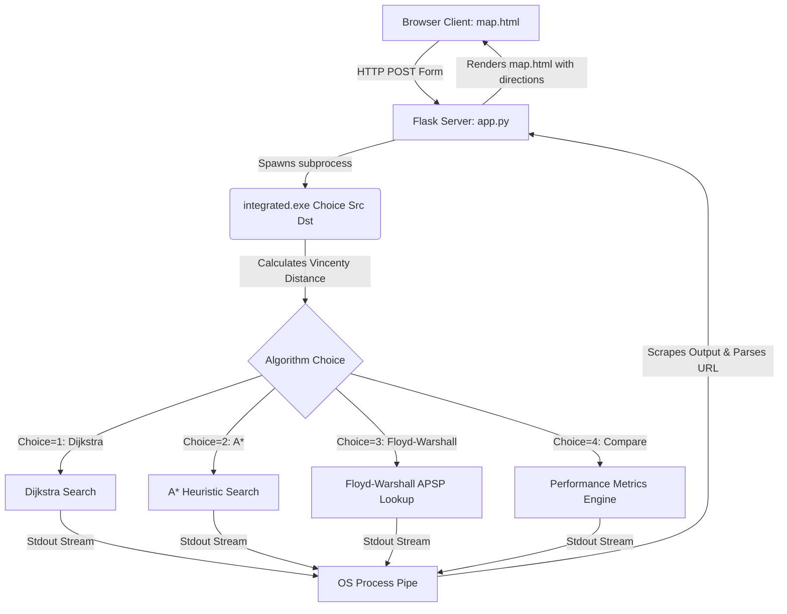

# GCEMnavERA – Smart Campus Navigation System

**Type:** Advanced Academic & Engineering Project  
**Target Institution:** Gopalan College of Engineering and Management (GCEM) *(System modeled on Graphic Era Campus)*

---

## 📋 Table of Contents
1. [Project Overview](#-project-overview)
2. [⚠️ Critical System Insight: Landmark & Coordinate Mismatch](#-critical-system-insight-landmark--coordinate-mismatch)
3. [🛠️ Technology Stack](#-technology-stack)
4. [📚 Algorithmic Engine & Implementations](#-algorithmic-engine--implementations)
5. [📊 Comparative Analysis of Algorithms (Detailed Differences)](#-comparative-analysis-of-algorithms-detailed-differences)
6. [🏗️ System Architecture & Process Integration](#-system-architecture--process-integration)
7. [🧠 Interviewer Q&A Preparation Guide](#-interviewer-qa-preparation-guide)
8. [⚙️ Installation, Compilation & Run Guide](#-installation-compilation--run-guide)

---

## 🔍 Project Overview

**GCEMnavERA** is a high-performance, visually premium campus navigation system. It bridges a modern web interface with a low-level high-performance C computational engine to provide:
1. **Interactive Layout Exploration:** Users click through a customized campus map, calling localized Flask routes that display detailed 2D zone imagery (Reception, Admissions, Labs, Hostels, and Cafés).
2. **Mathematically Shortest Path Calculation:** The system utilizes a compiled C backend (`integrated.exe`) executing three classic graph search algorithms (**Dijkstra**, **A***, and **Floyd-Warshall**) on a 28-node graph representation of the campus.
3. **Real-world Mapping Integration:** Route paths are dynamically plotted and visualized on **OpenStreetMap (OSM)**, rendering precise directions complete with geodesic calculations, walking time estimates, and step counts.

---

## ⚠️ Critical System Insight: Landmark & Coordinate Mismatch

> [!WARNING]
> **Important Note for Project Presentation / Submission:**  
> Although the system is branded as **GCEMnavERA** (representing Gopalan College of Engineering and Management), the landmark nodes and coordinates defined in `integrated.c` and mapped in `app.py` represent the **Graphic Era University (GEU)** and **Graphic Era Hill University (GEHU)** campuses in Dehradun, Uttarakhand, India (latitude ~30.268, longitude ~77.993).
> 
> * **Landmarks in Code:** `CSIT Block`, `B.Tech Block`, `Shantos Library`, `Graphic Era Hospital`, `GEHU Ground`, `Aryabhatt Lab`, etc.
> * **GPS Coordinate Center:** `30.268781, 77.993598` (corresponds directly to Dehradun, India, not Bangalore, Karnataka where GCEM is situated).
> * **Implication:** The system works flawlessly as a mock campus navigator. However, to deploy this specifically for Gopalan College of Engineering and Management (GCEM), you would need to update the `Node nodes[V]` struct array in `integrated.c` with GCEM's physical landmark names and corresponding GPS coordinates.

---

## 🛠️ Technology Stack

| Layer | Technology Used | Rationale / Purpose |
| :--- | :--- | :--- |
| **Frontend** | HTML5, Vanilla CSS3, JavaScript (ES6) | Responsive, modern UI utilizing CSS custom properties, glassmorphism design, modal overlay controllers, and interactive image maps. |
| **Backend Framework** | Python (Flask) | Lightweight routing engine serving templates, handling request forms, and piping subprocess commands. |
| **Computational Engine** | Low-Level C (`integrated.c`) | Fast, native C code compiled to `integrated.exe` maximizing CPU efficiency and minimizing memory footprint during graph searches. |
| **Inter-Process Interface** | Python `subprocess` | Standard input/output pipe passing algorithm selection, source, and destination parameters from Flask to the C executable and scraping results. |
| **Distance Metric** | Vincenty's Geodesic Formula | Calculates the shortest ellipsoidal distance between GPS coordinates using the WGS-84 ellipsoid model, accurate to within 0.5mm. |
| **Map Integration** | HTML Image Maps & OSM | Clickable map area coordinates linked to local Flask routes and directions parsed directly into OpenStreetMap query strings. |

---

## 📚 Algorithmic Engine & Implementations

The core C program represents the campus as a weighted graph $G = (V, E)$ where the vertices $V$ are campus buildings/blocks (28 total nodes) and edges $E$ are walkable pathways.

### 1. Dijkstra's Algorithm
* **Paradigm:** Greedy / Uninformed search.
* **Mechanism:** Maintains a list of tentative distances from the source. It visits the unvisited node with the smallest tentative distance, updates its neighbors' distances using dynamically computed Vincenty edge lengths, and marks the node as visited.
* **Pros:** Guaranteed to find the optimal shortest path on any graph with non-negative edge weights.
* **Cons:** Radially explores the graph in all directions (like a growing circle). It evaluates many nodes that lie in the opposite direction of the destination because it has no spatial awareness.

### 2. A* (A-Star) Search Algorithm
* **Paradigm:** Informed Search / Heuristic-based.
* **Mechanism:** Guides the search using the evaluation function $f(n) = g(n) + h(n)$:
  * $g(n)$: The exact accumulated walking distance from the source to the current node $n$.
  * $h(n)$: The heuristic estimate of the distance from node $n$ to the goal. In `integrated.c`, $h(n)$ is calculated using the **Vincenty geodesic formula** (straight-line distance to the target).
* **Pros:** Highly directed and focused. The heuristic biases search frontiers toward the destination, radically reducing the number of nodes expanded.
* **Cons:** Highly dependent on the heuristic. If the heuristic is not "admissible" (overestimates the distance), it may fail to find the shortest path. (Vincenty is admissible because straight-line distance is always $\le$ actual walking route distance).

### 3. Floyd-Warshall Algorithm
* **Paradigm:** Dynamic Programming / All-Pairs Shortest Path.
* **Mechanism:** Compares all possible paths through all vertices in the graph. It iteratively updates a 2D distance matrix by checking if passing through an intermediate vertex $k$ offers a shorter route between any pair $(i, j)$ than currently known:
  $$\text{dist}[i][j] = \min(\text{dist}[i][j], \text{dist}[i][k] + \text{dist}[k][j])$$
* **Pros:** Precomputes routes between **all pairs** of nodes. Once computed, any source-destination path query is a $O(1)$ constant time lookup.
* **Cons:** Time complexity is a rigid $O(V^3)$, which is computationally heavy for initialization on larger graphs, and it has an $O(V^2)$ space complexity.

---

## 📊 Comparative Analysis of Algorithms (Detailed Differences)

The following table and deep-dive detail the key algorithmic differences implemented in `integrated.c`:

| Feature / Metric | Dijkstra's Algorithm | A* Search Algorithm | Floyd-Warshall Algorithm |
| :--- | :--- | :--- | :--- |
| **Search Category** | Single-Source Shortest Path (SSSP) | Single-Source Single-Destination | All-Pairs Shortest Path (APSP) |
| **Exploration Style** | Uninformed (explores radially in all directions) | Informed (explores directionally toward destination) | Exhaustive Dynamic Programming (precalculates everything) |
| **Time Complexity** | $O(V^2)$ *(implemented as linear scan in `integrated.c`)* | $O(E \log V)$ *(implemented with binary min-heap)* | $O(V^3)$ *(strictly three nested loops)* |
| **Space Complexity** | $O(V)$ *(auxiliary arrays `dist`, `visited`, `prev`)* | $O(V)$ *(auxiliary arrays `gScore`, `fScore`, heap)* | $O(V^2)$ *(two $V \times V$ 2D matrices: distance and path pointer)* |
| **Heuristic Support** | None ($h(n) = 0$) | Yes (Vincenty straight-line distance) | None |
| **Memory Footprint** | Low (~0.11 KB for $V=28$) | Low (~0.33 KB for $V=28$) | Medium-High (~6.13 KB for $V=28$, scales quadratically) |
| **Walkway Blockage Resilience** | **High** (re-runs $O(V^2)$ dynamically on updated graphs) | **High** (re-runs $O(E \log V)$ on updated graphs) | **Low** (requires complete $O(V^3)$ recalculation of matrices) |
| **Best Suited For** | Routing where destinations are dynamic or unknown. | Real-time point-to-point map routing (GPS / Campus directions). | Dense, static networks with extremely high query frequency. |

### 🔍 Deep Dive: Theoretical vs. Practical Code Differences

1. **Frontier Expansion (Search Focus):**
   * **Dijkstra** is mathematically equivalent to A* where the heuristic $h(n) = 0$. Since it does not know where the destination is, it expands nodes in circular contours centered at the source.
   * **A*** uses spatial coordinates. By setting $h(n) = \text{VincentyDistance}(n, \text{goal})$, it prioritizes nodes that lie along the straight-line vector to the goal. In practice, this converts the circular search wave into an elongated ellipse oriented directly towards the target, skipping nodes in the opposite direction.
   
2. **Data Structure Optimizations in `integrated.c`:**
   * In `integrated.c`, **Dijkstra** uses a naive $O(V^2)$ matrix scan to select the minimum-distance vertex at each iteration. This is simple to code but slow for massive graphs.
   * **A*** is optimized with a custom struct-based **Binary Min-Heap Priority Queue** (`PriorityQueue` with `pqInsert` and `pqExtractMin`). This provides logarithmic $O(\log V)$ node retrieval, making the search loop highly efficient.
   * **Floyd-Warshall** does not use queues or search loops. It uses simple 2D arrays (`int graph[V][V]` and `int next[V][V]`) and updates them using three nested loops.

3. **Admissibility of the A* Heuristic:**
   * An A* heuristic is **admissible** if it never overestimates the actual cost to the destination.
   * In `integrated.c`, the heuristic is the ellipsoidal straight-line distance computed using the Vincenty formula. Because a straight line is the absolute shortest distance between two geographic coordinates, any real-world physical path (which must route around buildings, lawns, and fences) will be equal to or longer than this straight line. Thus, the heuristic is guaranteed to be admissible ($h(n) \le h^*(n)$) and **consistent**, ensuring A* always returns the mathematically optimal shortest path.

4. **Dynamic vs. Static Adaptability:**
   * If a campus path is blocked (e.g., due to construction), the graph edges can be modified.
   * **Dijkstra** and **A*** can recalculate the new shortest path instantly on the modified graph because they run dynamically on-demand.
   * **Floyd-Warshall** must re-run its entire $O(V^3)$ algorithm to re-populate the lookup matrices. This highlights why Floyd-Warshall is ideal for completely static architectures but unsuitable for dynamic environments (like real-time traffic maps).

---

## 🏗️ System Architecture & Process Integration

The system architecture utilizes a **polyglot layout** where Python handles high-level web routing and low-level C performs numerical computations:



---

## 🧠 Interviewer Q&A Preparation Guide

### Q1: Why write the algorithms in C and the frontend in Python?
**Answer:** This demonstrates **polyglot architecture** and **separation of concerns**. Python (Flask) is excellent for serving templates, routing, and handling HTTP requests. Low-level C (`integrated.c`) compiles directly to machine code (`integrated.exe`), running close to the bare metal. By offloading computational tasks (like graph search, matrix iteration, and trigonometric Vincenty calculations) to C, we maximize CPU efficiency and execute queries instantly with a microscopic memory footprint.

### Q2: What is the Vincenty Formula, and why use it over the simpler Haversine Formula?
**Answer:** The Haversine formula calculates distance assuming the Earth is a perfect sphere. However, the Earth is actually an oblate spheroid (flattened slightly at the poles). The Vincenty formula uses the WGS-84 reference ellipsoid model, which takes this flattening into account. While Haversine can have errors up to 0.5% in geographic calculations, Vincenty is accurate to within **0.5 millimeters** on the ellipsoid, making it the industry standard for high-accuracy Geolocation Information Systems (GIS).

### Q3: How does your A* Heuristic function work? Is it "admissible"?
**Answer:** Yes, the heuristic $h(n)$ is the straight-line Vincenty geodesic distance from the current node to the destination. An admissible heuristic must never overestimate the actual cost to reach the goal. Because a straight line is mathematically the shortest distance between two points, any actual walking route (navigating around buildings or walkways) will be $\ge$ the straight-line distance. Therefore, $h(n)$ never overestimates, ensuring A* will always find the optimal shortest path.

### Q4: What is the bottleneck of using `subprocess.run` to communicate between Python and C?
**Answer:** The primary bottleneck is **process creation overhead**. Every time a user requests a route, the OS must fork/spawn a new process, execute `integrated.exe`, allocate virtual memory, execute the C search, and pipe stdout back to Python.
* **Optimization/Solution:** Instead of spawning a subprocess, we can compile the C code as a Dynamic Link Library (`.dll` on Windows, `.so` on Linux) and load it directly into Python's memory space using the **`ctypes`** or **`cffi`** library, enabling near-zero latency in-memory calls.

### Q5: How does the Floyd-Warshall algorithm differ in utility from Dijkstra?
**Answer:** Dijkstra calculates paths from one node to others dynamically. If we have $N$ users querying paths, we run Dijkstra $N$ times. Floyd-Warshall solves the **All-Pairs** shortest path problem. It is computationally expensive ($O(V^3)$), but it computes the shortest path between *every* possible pair of vertices. If the graph is static (e.g. campus blocks do not move), we can run Floyd-Warshall **once** at server startup. Afterward, any route query is resolved in $O(1)$ constant time by just looking up the value in the precomputed 2D matrix.

---

## ⚙️ Installation, Compilation & Run Guide

### 1. Compile the C Backend (Optional)

> [!NOTE]
> A pre-compiled `integrated.exe` is already included in the `GCEM-system` folder. You only need to recompile the backend if you make modifications to the `integrated.c` source code.

To compile the C source code into an optimized executable:
```bash
gcc -O3 integrated.c -o integrated.exe
```
*(On Windows, you can compile with GCC from MinGW or MSVC cl.exe).*


### 2. Set Up the Virtual Environment & Dependencies
Navigate to the system directory and set up Python:
```bash
# Create a virtual environment
python -m venv venv

# Activate the virtual environment
# On Windows:
venv\Scripts\activate
# On macOS/Linux:
source venv/bin/activate

# Install Flask and other required dependencies
pip install -r requirements.txt
```

### 3. Run the Flask Application
Start the local development server:
```bash
python app.py
```
Open your browser and navigate to **[http://127.0.0.1:5000/](http://127.0.0.1:5000/)** to interact with the premium map visualizer.
